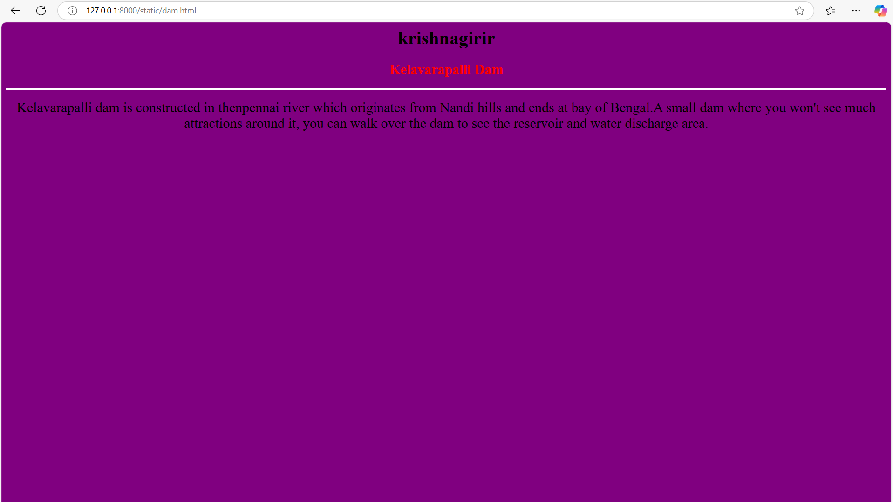
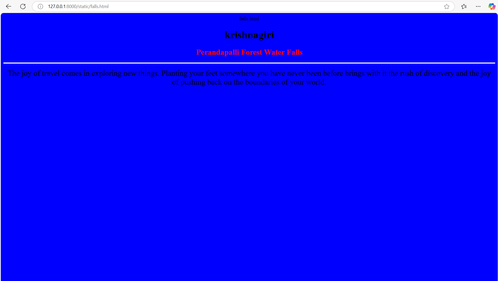
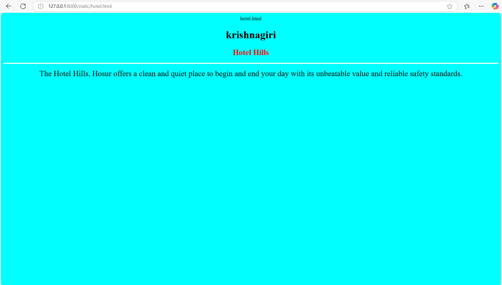
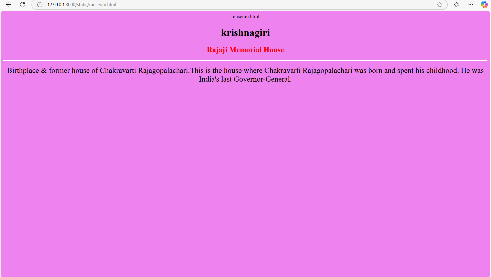
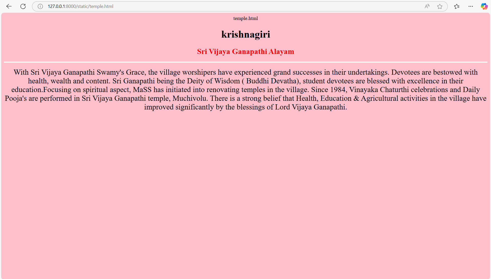

# Ex04 Places Around Me
## Date: 27/04/25

## AIM
To develop a website to display details about the places around my house.

## DESIGN STEPS

### STEP 1
Create a Django admin interface.

### STEP 2
Download your city map from Google.

### STEP 3
Using ```<map>``` tag name the map.

### STEP 4
Create clickable regions in the image using ```<area>``` tag.

### STEP 5
Write HTML programs for all the regions identified.

### STEP 6
Execute the programs and publish them.

## CODE
```
dam.html
<html>
    <h1 align="center">
        <font face="Times New Roman" color="black" size="6">krishnagirir</font>
    </h1>
    <h3 align="center">
        <font face="Times New Roman" color="red" size="5.5">Kelavarapalli Dam</font>
    </h3>
    <body bgcolor="purple" align="center">
        <hr size="4" color="white">
        <p align="center">
        <font face="Times New Roman" size="5">
            Kelavarapalli dam is constructed in thenpennai river which originates from Nandi hills and ends at bay of Bengal.A small dam where you won't see much attractions around it, you can walk over the dam to see the reservoir and water discharge area.
        </font>
        </p>
    </body>
</html>
```
```
falls.html
<html>
    <h1 align="center">
        <font face="Times New Roman" color="black" size="6">krishnagiri</font>
    </h1>
    <h3 align="center">
        <font face="Times New Roman" color="red" size="5.5">Perandapalli Forest Water Falls</font>
    </h3>
    <body bgcolor="blue" align="center">
        <hr size="4" color="white">
        <p align="center">
        <font face="Times New Roman" size="5">
            The joy of travel comes in exploring new things. Planting your feet somewhere you have never been before brings with it the rush of discovery and the joy of pushing back on the boundaries of your world.
        </font>
        </p>
    </body>
</html>
```
```
hotel.html
<html>
    <h1 align="center">
        <font face="Times New Roman" color="black" size="6">krishnagiri</font>
    </h1>
    <h3 align="center">
        <font face="Times New Roman" color="red" size="5.5">Hotel Hills</font>
    </h3>
    <body bgcolor="cyan" align="center">
        <hr size="4" color="white">
        <p align="center">
        <font face="Times New Roman" size="5">
            The Hotel Hills, Hosur offers a clean and quiet place to begin and end your day with its unbeatable value and reliable safety standards.
        </font>
        </p>
    </body>
</html>
```
```
museum.html
<html>
    <h1 align="center">
        <font face="Times New Roman" color="black" size="6">krishnagiri</font>
    </h1>
    <h3 align="center">
        <font face="Times New Roman" color="red" size="5.5">Rajaji Memorial House</font>
    </h3>
    <body bgcolor="violet" align="center">
        <hr size="4" color="white">
        <p align="center">
        <font face="Times New Roman" size="5">
            Birthplace & former house of Chakravarti Rajagopalachari.This is the house where Chakravarti Rajagopalachari was born and spent his childhood. He was India's last Governor-General.
        </font>
        </p>
    </body>
</html>
```
```
temple.html
<html>
    <h1 align="center">
        <font face="Times New Roman" color="black" size="6">krishnagiri</font>
    </h1>
    <h3 align="center">
        <font face="Times New Roman" color="red" size="5.5">Sri Vijaya Ganapathi Alayam</font>
    </h3>
    <body bgcolor="pink" align="center">
        <hr size="4" color="white">
        <p align="center">
        <font face="Times New Roman" size="5">
            With Sri Vijaya Ganapathi Swamy's Grace, the village worshipers have experienced grand successes in their undertakings. Devotees are bestowed with health, wealth and content. Sri Ganapathi being the Deity of Wisdom ( Buddhi Devatha), student devotees are blessed with excellence in their education.Focusing on spiritual aspect, MaSS has initiated into renovating temples in the village. Since 1984, Vinayaka Chaturthi celebrations and Daily Pooja's are performed in Sri Vijaya Ganapathi temple, Muchivolu. There is a strong belief that Health, Education & Agricultural activities in the village have improved significantly by the blessings of Lord Vijaya Ganapathi.
        </font>
        </p>
    </body>
</html>
```
## OUTPUT










## RESULT
The program for implementing image maps using HTML is executed successfully.
